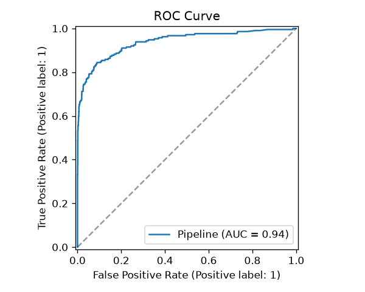
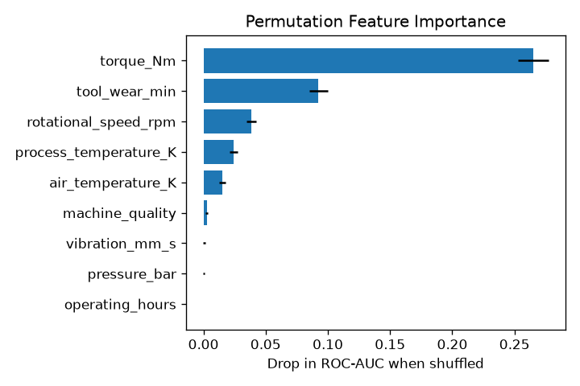

# Predictive Model for Mechanical Failure

A machine-learning pipeline that predicts whether an industrial machine is
about to fail, learned from past "accident" (failure-event) data. The goal is
**predictive maintenance**: flag at-risk machines from their live sensor
readings so they can be serviced *before* they break down.

> **Note on data.** No real accident dataset was supplied with this project, so
> it ships with a physically-grounded **synthetic data generator**
> (`src/generate_data.py`). The generator reproduces the well-documented
> behaviour of real predictive-maintenance datasets (interpretable failure
> modes plus noise), so the modelling pipeline is fully reproducible and the
> learned relationships are meaningful. To use your own historical accident
> records instead, replace `data/accidents.csv` with a file that has the same
> columns (see [Data schema](#data-schema)) and re-run training.

## Results

Three classifiers are compared with 5-fold stratified cross-validation;
**Gradient Boosting** wins and is evaluated on a held-out 20% test set:

| Metric (holdout)      | Score |
|-----------------------|-------|
| ROC-AUC               | 0.94  |
| Average precision (PR-AUC) | 0.81 |
| F1 (failure class)    | 0.75  |

The most predictive signals are **torque**, **tool wear**, and **rotational
speed** — consistent with the physics of overstrain and power failures.

Diagnostic plots are written to `reports/figures/`:




## Quickstart

```bash
pip install -r requirements.txt

python src/generate_data.py     # 1. (re)generate data/accidents.csv
python src/train.py             # 2. compare models, save the best one
python src/evaluate.py          # 3. write confusion matrix / ROC / PR / importance
python src/predict.py           # 4. demo prediction on sample machines
```

Score your own readings:

```bash
python src/predict.py --csv path/to/new_readings.csv --out scored.csv --threshold 0.5
```

## How it works

1. **`generate_data.py`** – synthesises labelled machine snapshots. Failures
   follow five interpretable modes:
   - *Heat Dissipation Failure* – small process/air temperature gap at low speed
   - *Power Failure* – mechanical power (torque × angular velocity) outside a safe envelope
   - *Overstrain Failure* – tool-wear × torque exceeds a quality-dependent limit
   - *Tool Wear Failure* – heavily worn tools failing at random
   - *Random Failure* – rare, unexplained events
2. **`train.py`** – builds a scikit-learn `Pipeline` (standardise numeric
   features + one-hot encode machine quality), compares Logistic Regression,
   Random Forest, and Gradient Boosting by cross-validated ROC-AUC, refits the
   winner, and saves `models/failure_model.joblib` + `models/metrics.json`.
   Class imbalance is handled with `class_weight="balanced"` / boosting.
3. **`evaluate.py`** – produces confusion-matrix, ROC, precision–recall, and
   permutation-importance figures from the held-out test set.
4. **`predict.py`** – loads the saved pipeline and scores new readings,
   emitting a `failure_probability` and a thresholded `predicted_failure`.

## Data schema

`data/accidents.csv` columns (features + labels):

| Column | Type | Description |
|--------|------|-------------|
| `machine_quality` | categorical (L/M/H) | build quality / variant |
| `air_temperature_K` | float | ambient temperature (K) |
| `process_temperature_K` | float | process temperature (K) |
| `rotational_speed_rpm` | float | spindle speed (rpm) |
| `torque_Nm` | float | applied torque (N·m) |
| `tool_wear_min` | int | cumulative tool wear (minutes) |
| `operating_hours` | float | hours since last maintenance |
| `vibration_mm_s` | float | vibration velocity (mm/s) |
| `pressure_bar` | float | working pressure (bar) |
| `failure_type` | categorical | failure mode (label, not a feature) |
| `machine_failure` | 0/1 | **prediction target** |

> `failure_type` is excluded from the feature set during training to avoid
> label leakage; only `machine_failure` is predicted.

## Project layout

```
.
├── data/                 # accidents.csv (generated)
├── models/               # failure_model.joblib + metrics.json
├── reports/figures/      # evaluation plots
├── src/
│   ├── generate_data.py  # synthetic accident-data generator
│   ├── train.py          # model comparison, selection, persistence
│   ├── evaluate.py       # diagnostic figures
│   └── predict.py        # scoring CLI
├── requirements.txt
└── README.md
```

## Adapting to real data

Replace the synthetic CSV with your historical failure records using the same
schema, then run `train.py` / `evaluate.py`. If your real data has fewer or
extra sensors, update the `numeric` / `CATEGORICAL` column lists at the top of
`src/train.py` and the `FEATURE_COLUMNS` list in `src/predict.py`.
